# Inventory Server Architecture

This document provides a comprehensive architectural overview of the inventory-server application, including UML class diagrams, entity-relationship diagrams, and sequence diagrams.

## Table of Contents

1. [System Overview](#system-overview)
2. [Component Diagram](#component-diagram)
3. [UML Class Diagrams](#uml-class-diagrams)
4. [Entity Relationship Diagram](#entity-relationship-diagram)
5. [Sequence Diagrams](#sequence-diagrams)
   - [Agent Check-in Payload Schema](#agent-check-in-payload-schema)
6. [Network Architecture](#network-architecture)
7. [Error Handling Flows](#error-handling-flows)
8. [Module Dependencies](#module-dependencies)

---

## System Overview

The inventory-server is a REST API server that receives check-in data from inventory-agent instances and persists it to SQLite. It provides both an API endpoint for agent check-ins and a web UI for viewing device inventory.

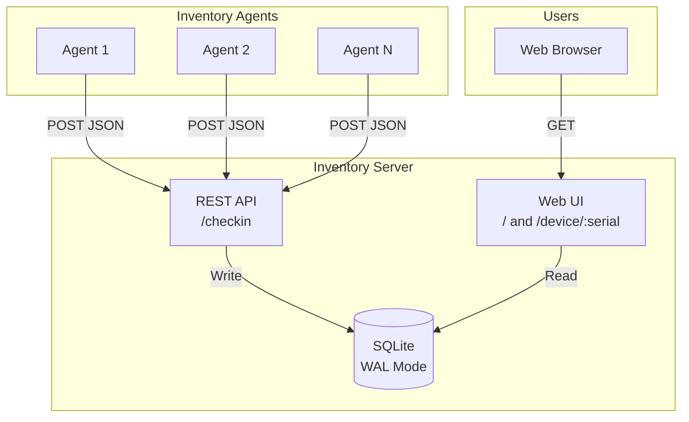
```mermaid
flowchart TB
    subgraph Agents["Inventory Agents"]
        A1[Agent 1]
        A2[Agent 2]
        A3[Agent N]
    end

    subgraph Server["Inventory Server"]
        API[REST API<br>/checkin]
        WEB[Web UI<br>/ and /device/:serial]
        DB[(SQLite<br>WAL Mode)]
    end

    subgraph Users["Users"]
        Browser[Web Browser]
    end

    A1 -->|POST JSON| API
    A2 -->|POST JSON| API
    A3 -->|POST JSON| API
    API -->|Write| DB
    WEB -->|Read| DB
    Browser -->|GET| WEB
```

---

## Component Diagram

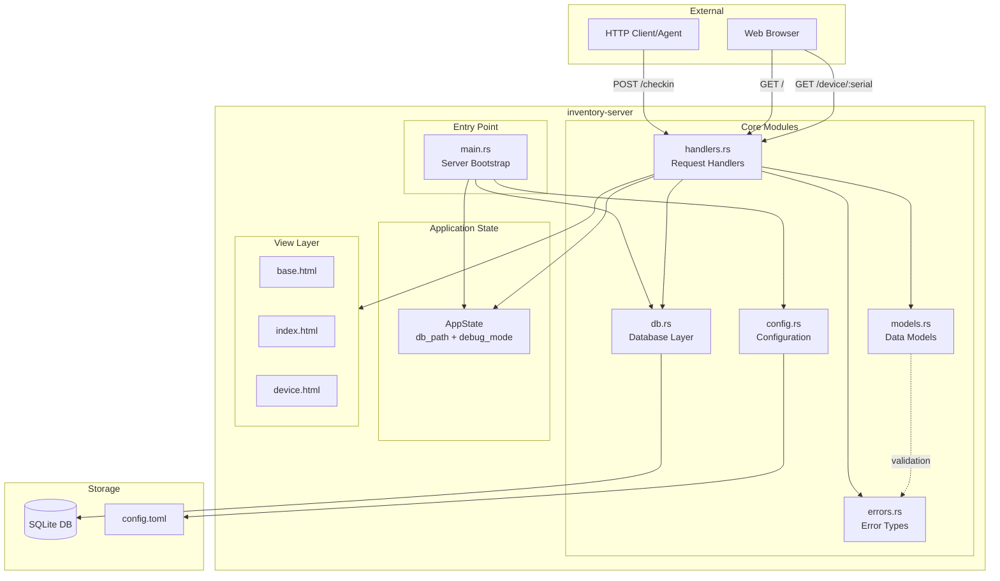
```mermaid
flowchart TB
    subgraph External
        Client[HTTP Client/Agent]
        Browser[Web Browser]
    end

    subgraph InventoryServer["inventory-server"]
        subgraph EntryPoint["Entry Point"]
            Main[main.rs<br>Server Bootstrap]
        end

        subgraph Core["Core Modules"]
            Config[config.rs<br>Configuration]
            Handlers[handlers.rs<br>Request Handlers]
            Models[models.rs<br>Data Models]
            DB[db.rs<br>Database Layer]
            Errors[errors.rs<br>Error Types]
        end

        subgraph State["Application State"]
            AppState[AppState<br>db_path + debug_mode]
        end

        subgraph Templates["View Layer"]
            Base[base.html]
            Index[index.html]
            Device[device.html]
        end
    end

    subgraph Storage
        SQLite[(SQLite DB)]
        ConfigFile[config.toml]
    end

    Client -->|POST /checkin| Handlers
    Browser -->|GET /| Handlers
    Browser -->|GET /device/:serial| Handlers

    Main --> Config
    Main --> DB
    Main --> AppState
    Config --> ConfigFile

    Handlers --> Models
    Handlers --> DB
    Handlers --> Errors
    Handlers --> Templates
    Handlers --> AppState

    DB --> SQLite
    Models -.->|validation| Errors
```

---

## UML Class Diagrams

### Domain Models

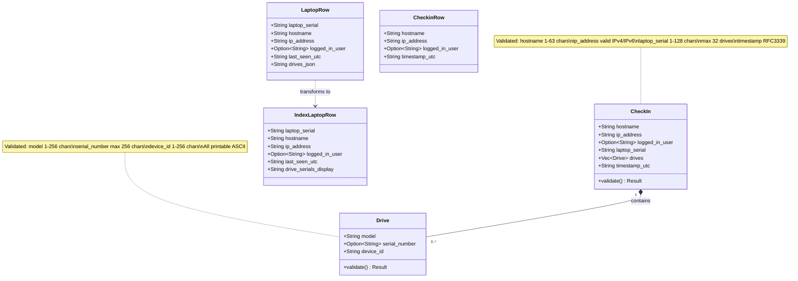
```mermaid
classDiagram
    class Drive {
        +String model
        +Option~String~ serial_number
        +String device_id
        +validate() Result
    }

    class CheckIn {
        +String hostname
        +String ip_address
        +Option~String~ logged_in_user
        +String laptop_serial
        +Vec~Drive~ drives
        +String timestamp_utc
        +validate() Result
    }

    class LaptopRow {
        +String laptop_serial
        +String hostname
        +String ip_address
        +Option~String~ logged_in_user
        +String last_seen_utc
        +String drives_json
    }

    class CheckinRow {
        +String hostname
        +String ip_address
        +Option~String~ logged_in_user
        +String timestamp_utc
    }

    class IndexLaptopRow {
        +String laptop_serial
        +String hostname
        +String ip_address
        +Option~String~ logged_in_user
        +String last_seen_utc
        +String drive_serials_display
    }

    CheckIn "1" *-- "0..*" Drive : contains
    LaptopRow ..> IndexLaptopRow : transforms to

    note for Drive "Validated: model 1-256 chars\nserial_number max 256 chars\ndevice_id 1-256 chars\nAll printable ASCII"

    note for CheckIn "Validated: hostname 1-63 chars\nip_address valid IPv4/IPv6\nlaptop_serial 1-128 chars\nmax 32 drives\ntimestamp RFC3339"
```

### Configuration

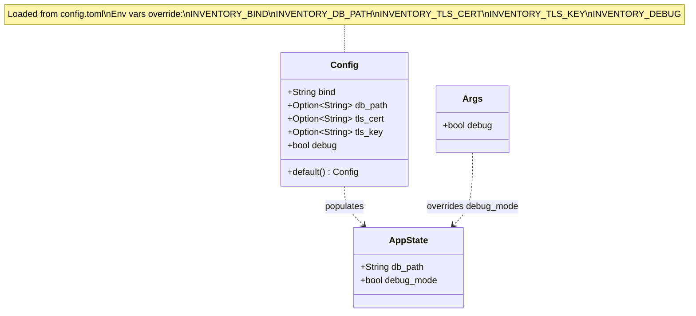
```mermaid
classDiagram
    class Config {
        +String bind
        +Option~String~ db_path
        +Option~String~ tls_cert
        +Option~String~ tls_key
        +bool debug
        +default() Config
    }

    class AppState {
        +String db_path
        +bool debug_mode
    }

    class Args {
        +bool debug
    }

    Config ..> AppState : populates
    Args ..> AppState : overrides debug_mode

    note for Config "Loaded from config.toml\nEnv vars override:\nINVENTORY_BIND\nINVENTORY_DB_PATH\nINVENTORY_TLS_CERT\nINVENTORY_TLS_KEY\nINVENTORY_DEBUG"
```

### Error Types

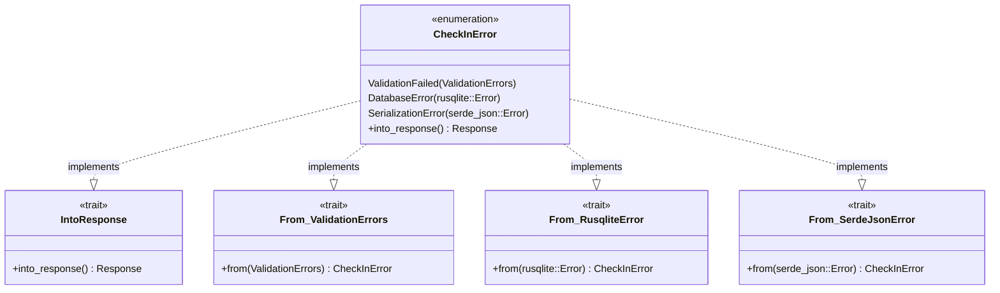
```mermaid
classDiagram
    class CheckInError {
        <<enumeration>>
        ValidationFailed(ValidationErrors)
        DatabaseError(rusqlite::Error)
        SerializationError(serde_json::Error)
        +into_response() Response
    }

    class IntoResponse {
        <<trait>>
        +into_response() Response
    }

    class From_ValidationErrors {
        <<trait>>
        +from(ValidationErrors) CheckInError
    }

    class From_RusqliteError {
        <<trait>>
        +from(rusqlite::Error) CheckInError
    }

    class From_SerdeJsonError {
        <<trait>>
        +from(serde_json::Error) CheckInError
    }

    CheckInError ..|> IntoResponse : implements
    CheckInError ..|> From_ValidationErrors : implements
    CheckInError ..|> From_RusqliteError : implements
    CheckInError ..|> From_SerdeJsonError : implements
```

### Template Structs

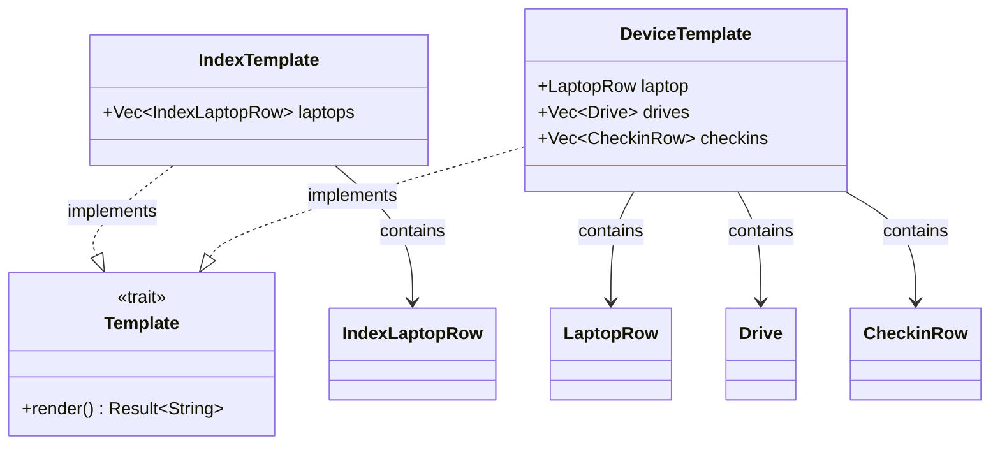
```mermaid
classDiagram
    class IndexTemplate {
        +Vec~IndexLaptopRow~ laptops
    }

    class DeviceTemplate {
        +LaptopRow laptop
        +Vec~Drive~ drives
        +Vec~CheckinRow~ checkins
    }

    class Template {
        <<trait>>
        +render() Result~String~
    }

    IndexTemplate ..|> Template : implements
    DeviceTemplate ..|> Template : implements
    IndexTemplate --> IndexLaptopRow : contains
    DeviceTemplate --> LaptopRow : contains
    DeviceTemplate --> Drive : contains
    DeviceTemplate --> CheckinRow : contains
```

### Handlers and Functions

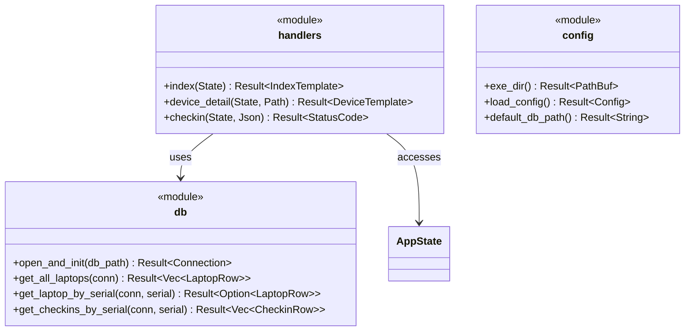
```mermaid
classDiagram
    class handlers {
        <<module>>
        +index(State) Result~IndexTemplate~
        +device_detail(State, Path) Result~DeviceTemplate~
        +checkin(State, Json) Result~StatusCode~
    }

    class db {
        <<module>>
        +open_and_init(db_path) Result~Connection~
        +get_all_laptops(conn) Result~Vec~LaptopRow~~
        +get_laptop_by_serial(conn, serial) Result~Option~LaptopRow~~
        +get_checkins_by_serial(conn, serial) Result~Vec~CheckinRow~~
    }

    class config {
        <<module>>
        +exe_dir() Result~PathBuf~
        +load_config() Result~Config~
        +default_db_path() Result~String~
    }

    handlers --> db : uses
    handlers --> AppState : accesses
```

### Validation Functions

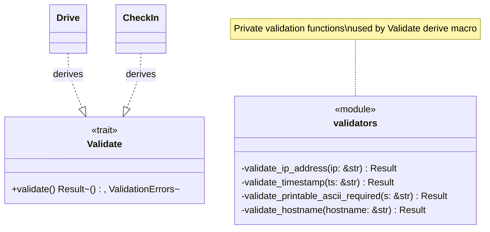
```mermaid
classDiagram
    class validators {
        <<module>>
        -validate_ip_address(ip: &str) Result
        -validate_timestamp(ts: &str) Result
        -validate_printable_ascii_required(s: &str) Result
        -validate_hostname(hostname: &str) Result
    }

    class Validate {
        <<trait>>
        +validate() Result~(), ValidationErrors~
    }

    Drive ..|> Validate : derives
    CheckIn ..|> Validate : derives

    note for validators "Private validation functions\nused by Validate derive macro"
```

---

## Entity Relationship Diagram

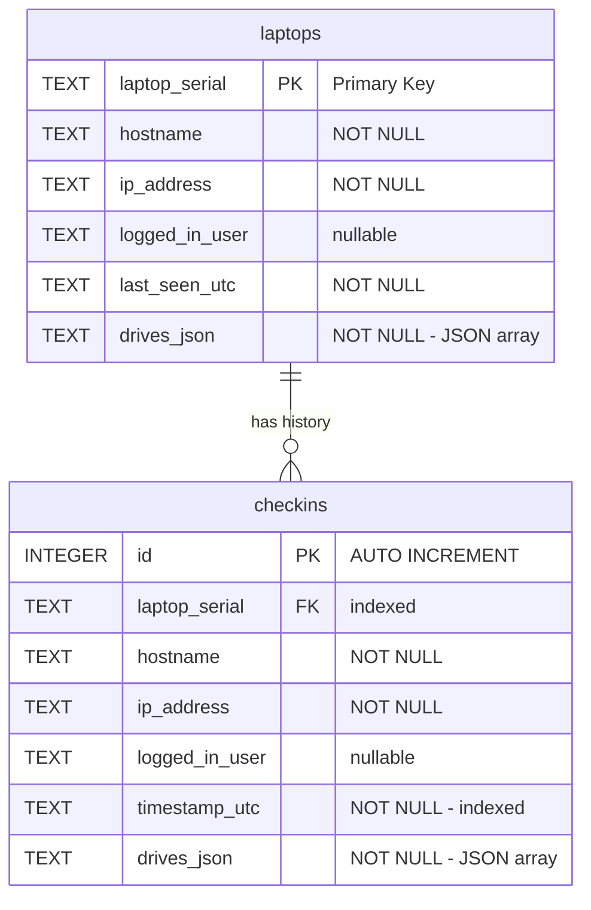
```mermaid
erDiagram
    laptops {
        TEXT laptop_serial PK "Primary Key"
        TEXT hostname "NOT NULL"
        TEXT ip_address "NOT NULL"
        TEXT logged_in_user "nullable"
        TEXT last_seen_utc "NOT NULL"
        TEXT drives_json "NOT NULL - JSON array"
    }

    checkins {
        INTEGER id PK "AUTO INCREMENT"
        TEXT laptop_serial FK "indexed"
        TEXT hostname "NOT NULL"
        TEXT ip_address "NOT NULL"
        TEXT logged_in_user "nullable"
        TEXT timestamp_utc "NOT NULL - indexed"
        TEXT drives_json "NOT NULL - JSON array"
    }

    laptops ||--o{ checkins : "has history"
```

### Database Indexes

```mermaid
flowchart LR
    subgraph Indexes
        I1[idx_checkins_laptop_serial<br>ON checkins(laptop_serial)]
        I2[idx_checkins_timestamp<br>ON checkins(timestamp_utc)]
    end

    subgraph Tables
        T1[laptops<br>PK: laptop_serial]
        T2[checkins<br>PK: id AUTO]
    end

    I1 --> T2
    I2 --> T2
```

### drives_json Schema (Embedded JSON)

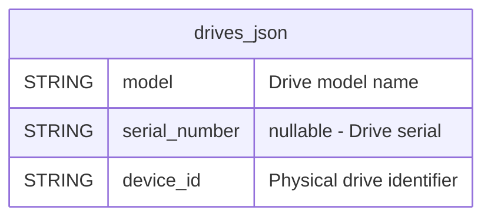
```mermaid
erDiagram
    drives_json {
        STRING model "Drive model name"
        STRING serial_number "nullable - Drive serial"
        STRING device_id "Physical drive identifier"
    }
```

---

## Sequence Diagrams

### Agent Check-in Flow (POST /checkin)

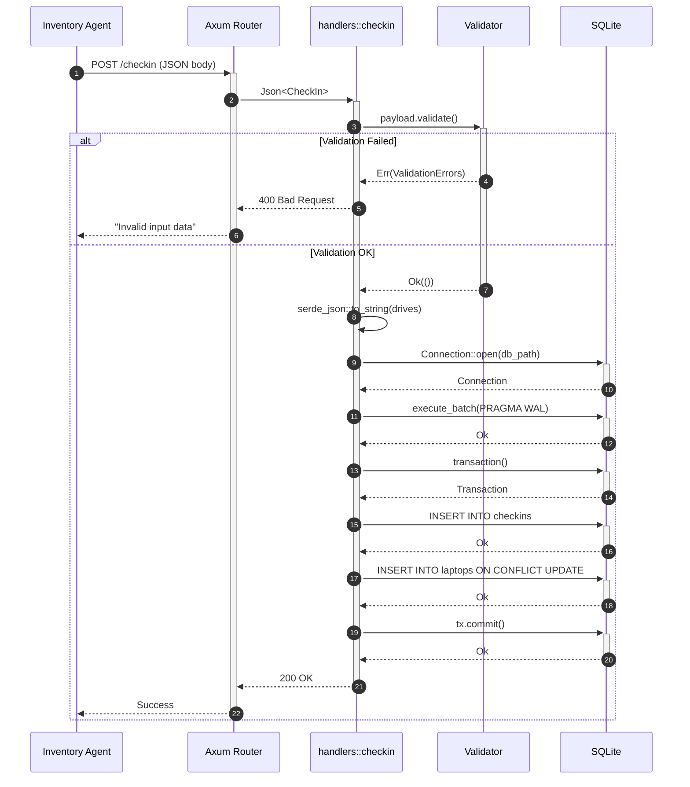
```mermaid
sequenceDiagram
    autonumber
    participant Agent as Inventory Agent
    participant Axum as Axum Router
    participant Handler as handlers::checkin
    participant Validator as Validator
    participant DB as SQLite

    Agent->>+Axum: POST /checkin (JSON body)
    Axum->>+Handler: Json<CheckIn>

    Handler->>+Validator: payload.validate()

    alt Validation Failed
        Validator-->>Handler: Err(ValidationErrors)
        Handler-->>Axum: 400 Bad Request
        Axum-->>Agent: "Invalid input data"
    else Validation OK
        Validator-->>-Handler: Ok(())

        Handler->>Handler: serde_json::to_string(drives)
        Handler->>+DB: Connection::open(db_path)
        DB-->>-Handler: Connection

        Handler->>+DB: execute_batch(PRAGMA WAL)
        DB-->>-Handler: Ok

        Handler->>+DB: transaction()
        DB-->>-Handler: Transaction

        Handler->>+DB: INSERT INTO checkins
        DB-->>-Handler: Ok

        Handler->>+DB: INSERT INTO laptops ON CONFLICT UPDATE
        DB-->>-Handler: Ok

        Handler->>+DB: tx.commit()
        DB-->>-Handler: Ok

        Handler-->>-Axum: 200 OK
        Axum-->>-Agent: Success
    end
```

### Dashboard View Flow (GET /)

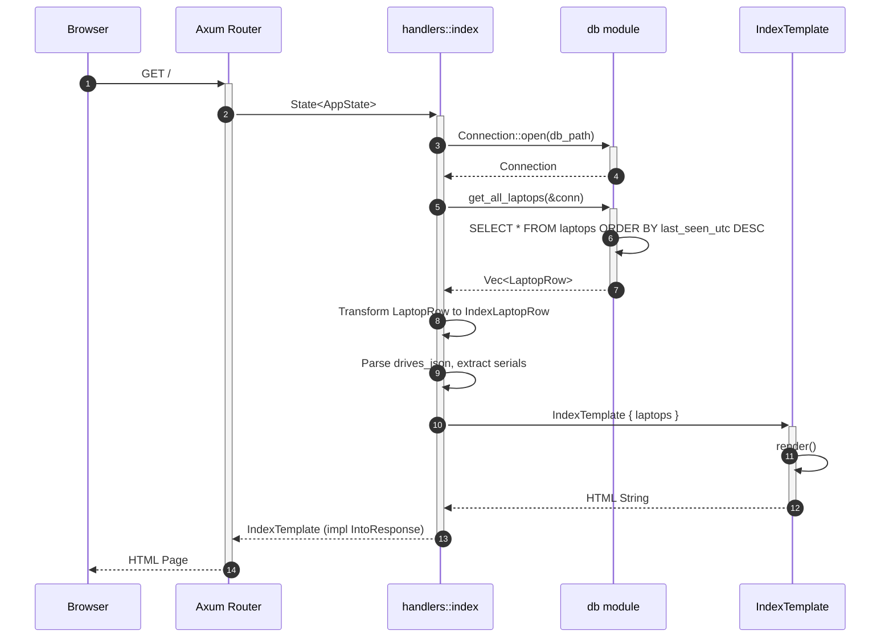
```mermaid
sequenceDiagram
    autonumber
    participant Browser
    participant Axum as Axum Router
    participant Handler as handlers::index
    participant DB as db module
    participant Template as IndexTemplate

    Browser->>+Axum: GET /
    Axum->>+Handler: State<AppState>

    Handler->>+DB: Connection::open(db_path)
    DB-->>-Handler: Connection

    Handler->>+DB: get_all_laptops(&conn)
    DB->>DB: SELECT * FROM laptops ORDER BY last_seen_utc DESC
    DB-->>-Handler: Vec<LaptopRow>

    Handler->>Handler: Transform LaptopRow to IndexLaptopRow
    Handler->>Handler: Parse drives_json, extract serials

    Handler->>+Template: IndexTemplate { laptops }
    Template->>Template: render()
    Template-->>-Handler: HTML String

    Handler-->>-Axum: IndexTemplate (impl IntoResponse)
    Axum-->>-Browser: HTML Page
```

### Device Detail Flow (GET /device/:serial)

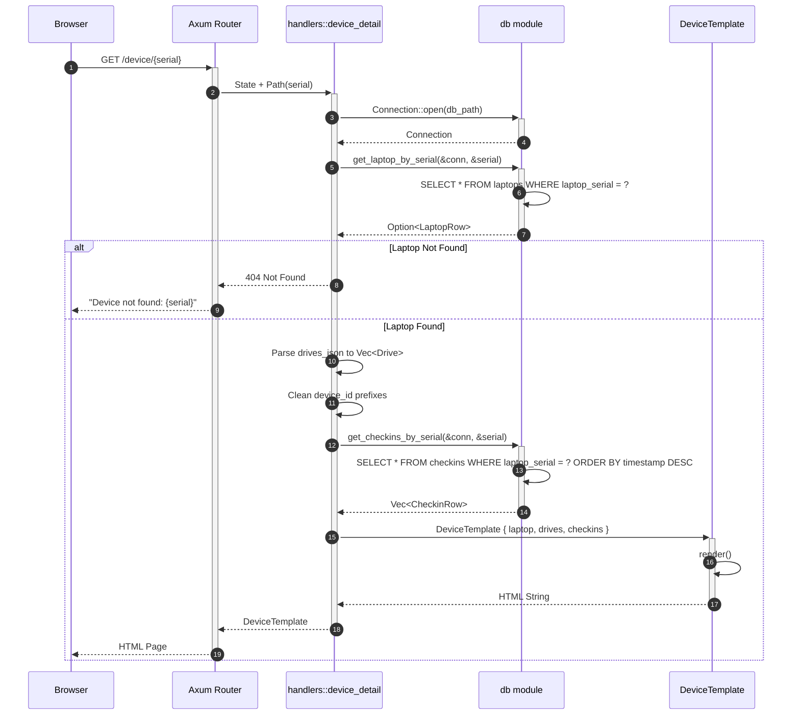
```mermaid
sequenceDiagram
    autonumber
    participant Browser
    participant Axum as Axum Router
    participant Handler as handlers::device_detail
    participant DB as db module
    participant Template as DeviceTemplate

    Browser->>+Axum: GET /device/{serial}
    Axum->>+Handler: State + Path(serial)

    Handler->>+DB: Connection::open(db_path)
    DB-->>-Handler: Connection

    Handler->>+DB: get_laptop_by_serial(&conn, &serial)
    DB->>DB: SELECT * FROM laptops WHERE laptop_serial = ?
    DB-->>-Handler: Option<LaptopRow>

    alt Laptop Not Found
        Handler-->>Axum: 404 Not Found
        Axum-->>Browser: "Device not found: {serial}"
    else Laptop Found
        Handler->>Handler: Parse drives_json to Vec<Drive>
        Handler->>Handler: Clean device_id prefixes

        Handler->>+DB: get_checkins_by_serial(&conn, &serial)
        DB->>DB: SELECT * FROM checkins WHERE laptop_serial = ? ORDER BY timestamp DESC
        DB-->>-Handler: Vec<CheckinRow>

        Handler->>+Template: DeviceTemplate { laptop, drives, checkins }
        Template->>Template: render()
        Template-->>-Handler: HTML String

        Handler-->>-Axum: DeviceTemplate
        Axum-->>-Browser: HTML Page
    end
```

### Server Startup Flow

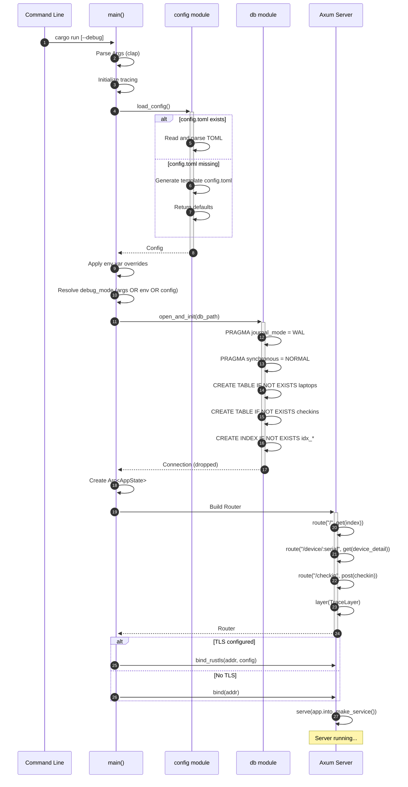
```mermaid
sequenceDiagram
    autonumber
    participant CLI as Command Line
    participant Main as main()
    participant Config as config module
    participant DB as db module
    participant Axum as Axum Server

    CLI->>+Main: cargo run [--debug]
    Main->>Main: Parse Args (clap)
    Main->>Main: Initialize tracing

    Main->>+Config: load_config()

    alt config.toml exists
        Config->>Config: Read and parse TOML
    else config.toml missing
        Config->>Config: Generate template config.toml
        Config->>Config: Return defaults
    end
    Config-->>-Main: Config

    Main->>Main: Apply env var overrides
    Main->>Main: Resolve debug_mode (args OR env OR config)

    Main->>+DB: open_and_init(db_path)
    DB->>DB: PRAGMA journal_mode = WAL
    DB->>DB: PRAGMA synchronous = NORMAL
    DB->>DB: CREATE TABLE IF NOT EXISTS laptops
    DB->>DB: CREATE TABLE IF NOT EXISTS checkins
    DB->>DB: CREATE INDEX IF NOT EXISTS idx_*
    DB-->>-Main: Connection (dropped)

    Main->>Main: Create Arc<AppState>

    Main->>+Axum: Build Router
    Axum->>Axum: route("/", get(index))
    Axum->>Axum: route("/device/:serial", get(device_detail))
    Axum->>Axum: route("/checkin", post(checkin))
    Axum->>Axum: layer(TraceLayer)
    Axum-->>-Main: Router

    alt TLS configured
        Main->>Axum: bind_rustls(addr, config)
    else No TLS
        Main->>Axum: bind(addr)
    end

    Axum->>Axum: serve(app.into_make_service())
    Note over Axum: Server running...
```

### Agent Check-in Payload Schema

The inventory agent sends a JSON payload to `POST /checkin` with the following structure:

```json
{
  "hostname": "LAPTOP-ABC123",
  "ip_address": "192.168.1.100",
  "logged_in_user": "DOMAIN\\username",
  "laptop_serial": "SN123456789",
  "timestamp_utc": "2025-12-26T10:30:00Z",
  "drives": [
    {
      "model": "Samsung SSD 970 EVO Plus",
      "serial_number": "S5H2NS0N123456",
      "device_id": "\\\\.\\PHYSICALDRIVE0"
    },
    {
      "model": "WD Blue 1TB",
      "serial_number": null,
      "device_id": "\\\\.\\PHYSICALDRIVE1"
    }
  ]
}
```

#### Validation Constraints

| Field | Type | Constraints | Validation |
|-------|------|-------------|------------|
| `hostname` | String | 1-63 chars | Alphanumeric, hyphens, underscores; must start/end with alphanumeric |
| `ip_address` | String | Required | Valid IPv4 or IPv6 address |
| `logged_in_user` | String? | Max 512 chars | Printable ASCII only; nullable |
| `laptop_serial` | String | 1-128 chars | Printable ASCII only |
| `timestamp_utc` | String | Required | RFC3339 format (e.g., `2025-12-26T10:30:00Z`) |
| `drives` | Array | Max 32 items | Nested validation on each Drive |

#### Drive Object Constraints

| Field | Type | Constraints | Validation |
|-------|------|-------------|------------|
| `model` | String | 1-256 chars | Printable ASCII only |
| `serial_number` | String? | Max 256 chars | Printable ASCII only; nullable |
| `device_id` | String | 1-256 chars | Printable ASCII only |

#### Example cURL Request

```bash
curl -X POST https://inventory-server:8443/checkin \
  -H "Content-Type: application/json" \
  -d '{
    "hostname": "WORKSTATION-01",
    "ip_address": "10.0.0.50",
    "logged_in_user": "CORP\\jsmith",
    "laptop_serial": "DELL-SVC-TAG-123",
    "timestamp_utc": "2025-12-26T15:45:00Z",
    "drives": [
      {
        "model": "SAMSUNG MZVLB512HBJQ-000L7",
        "serial_number": "S4EVNF0M123456",
        "device_id": "\\\\.\\PHYSICALDRIVE0"
      }
    ]
  }'
```

---

## Network Architecture

### Connection Flow

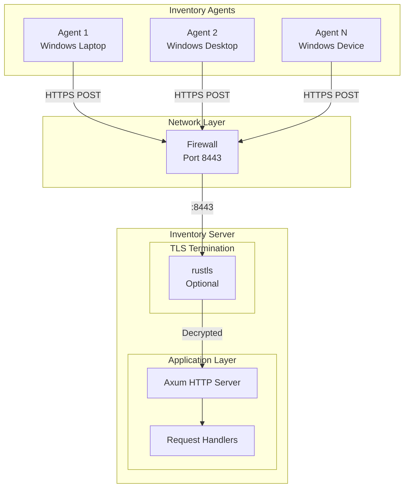
```mermaid
flowchart TB
    subgraph Agents["Inventory Agents"]
        A1[Agent 1<br>Windows Laptop]
        A2[Agent 2<br>Windows Desktop]
        A3[Agent N<br>Windows Device]
    end

    subgraph Network["Network Layer"]
        FW[Firewall<br>Port 8443]
    end

    subgraph Server["Inventory Server"]
        subgraph TLSLayer["TLS Termination"]
            RUSTLS[rustls<br>Optional]
        end
        subgraph AppLayer["Application Layer"]
            AXUM[Axum HTTP Server]
            HANDLER[Request Handlers]
        end
    end

    A1 -->|HTTPS POST| FW
    A2 -->|HTTPS POST| FW
    A3 -->|HTTPS POST| FW
    FW -->|:8443| RUSTLS
    RUSTLS -->|Decrypted| AXUM
    AXUM --> HANDLER
```

### TLS Configuration Options

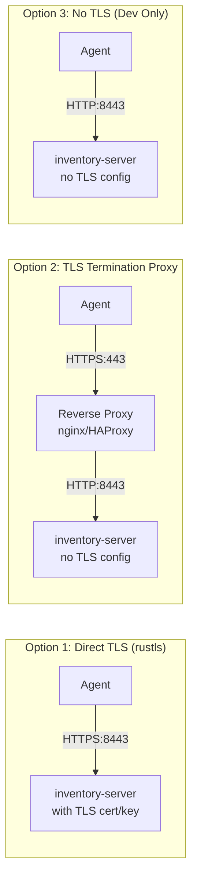
```mermaid
flowchart LR
    subgraph Option1["Option 1: Direct TLS (rustls)"]
        Agent1[Agent] -->|HTTPS:8443| Server1[inventory-server<br>with TLS cert/key]
    end

    subgraph Option2["Option 2: TLS Termination Proxy"]
        Agent2[Agent] -->|HTTPS:443| Proxy[Reverse Proxy<br>nginx/HAProxy]
        Proxy -->|HTTP:8443| Server2[inventory-server<br>no TLS config]
    end

    subgraph Option3["Option 3: No TLS (Dev Only)"]
        Agent3[Agent] -->|HTTP:8443| Server3[inventory-server<br>no TLS config]
    end
```

### Port and Binding Configuration

| Setting | Default | Environment Variable | Config File |
|---------|---------|---------------------|-------------|
| Bind Address | `0.0.0.0:8443` | `INVENTORY_BIND` | `bind` |
| TLS Certificate | None | `INVENTORY_TLS_CERT` | `tls_cert` |
| TLS Private Key | None | `INVENTORY_TLS_KEY` | `tls_key` |

### Connection Lifecycle

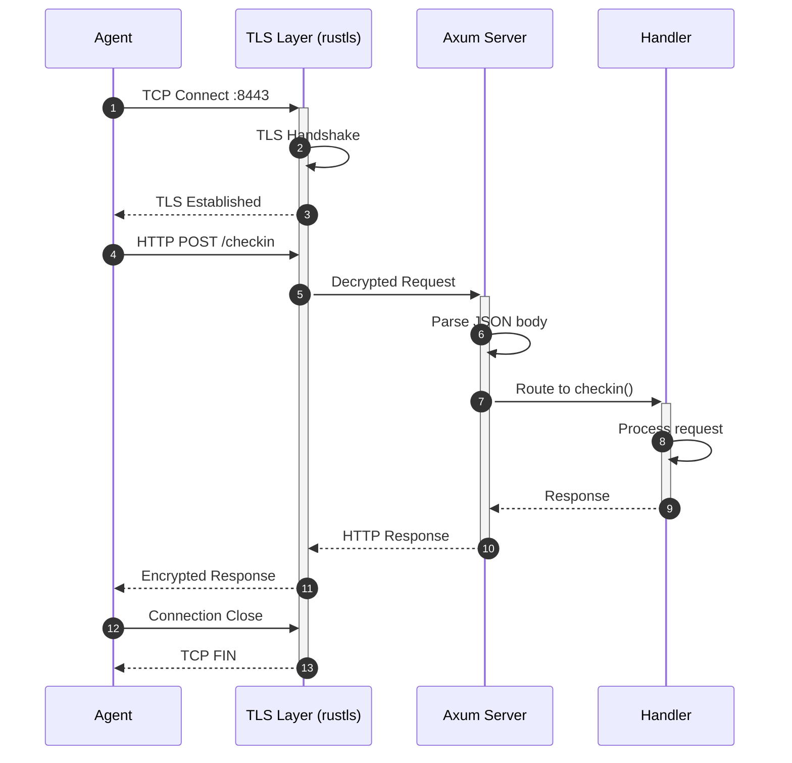
```mermaid
sequenceDiagram
    autonumber
    participant Agent
    participant TLS as TLS Layer (rustls)
    participant Axum as Axum Server
    participant Handler

    Agent->>+TLS: TCP Connect :8443
    TLS->>TLS: TLS Handshake
    TLS-->>Agent: TLS Established

    Agent->>TLS: HTTP POST /checkin
    TLS->>+Axum: Decrypted Request
    Axum->>Axum: Parse JSON body
    Axum->>+Handler: Route to checkin()
    Handler->>Handler: Process request
    Handler-->>-Axum: Response
    Axum-->>-TLS: HTTP Response
    TLS-->>Agent: Encrypted Response

    Agent->>TLS: Connection Close
    TLS-->>-Agent: TCP FIN
```

---

## Error Handling Flows

### Validation Failure (400 Bad Request)

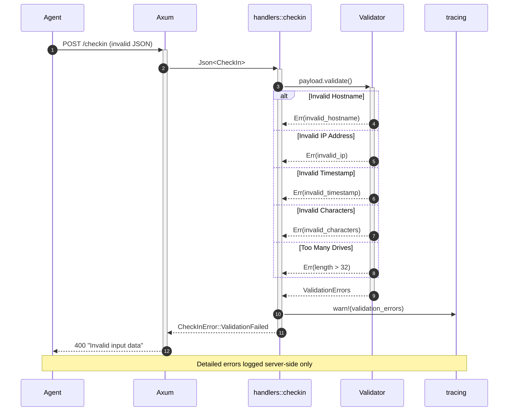
```mermaid
sequenceDiagram
    autonumber
    participant Agent
    participant Axum
    participant Handler as handlers::checkin
    participant Validator
    participant Logger as tracing

    Agent->>+Axum: POST /checkin (invalid JSON)
    Axum->>+Handler: Json<CheckIn>

    Handler->>+Validator: payload.validate()

    alt Invalid Hostname
        Validator-->>Handler: Err(invalid_hostname)
    else Invalid IP Address
        Validator-->>Handler: Err(invalid_ip)
    else Invalid Timestamp
        Validator-->>Handler: Err(invalid_timestamp)
    else Invalid Characters
        Validator-->>Handler: Err(invalid_characters)
    else Too Many Drives
        Validator-->>Handler: Err(length > 32)
    end

    Validator-->>-Handler: ValidationErrors

    Handler->>Logger: warn!(validation_errors)
    Handler-->>-Axum: CheckInError::ValidationFailed
    Axum-->>-Agent: 400 "Invalid input data"

    Note over Agent,Logger: Detailed errors logged server-side only
```

### Database Connection Failure (500 Internal Server Error)

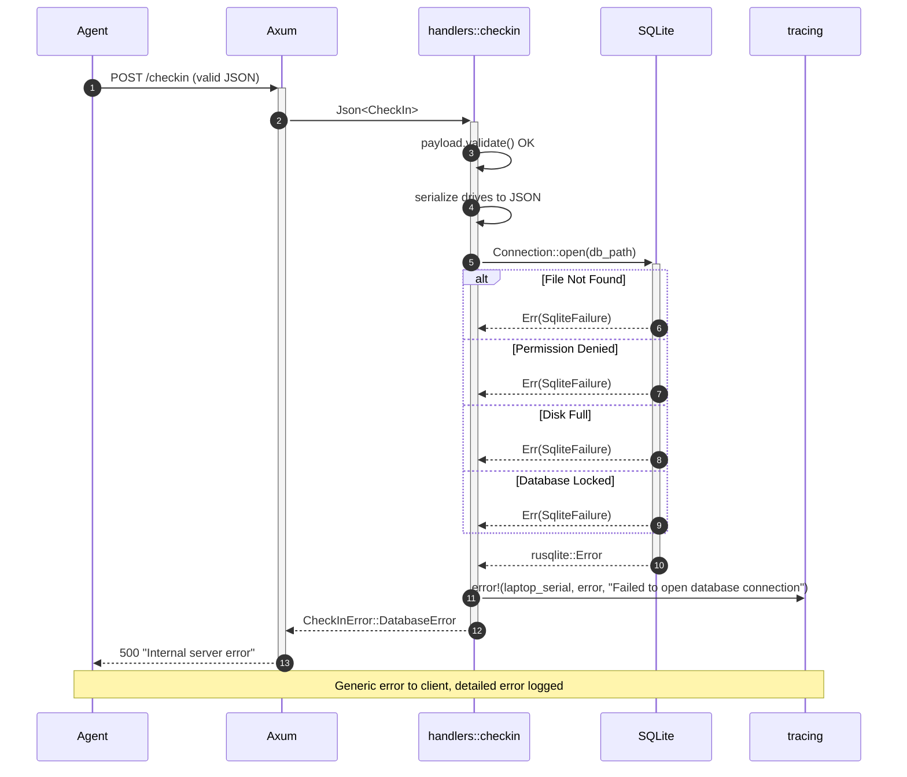
```mermaid
sequenceDiagram
    autonumber
    participant Agent
    participant Axum
    participant Handler as handlers::checkin
    participant DB as SQLite
    participant Logger as tracing

    Agent->>+Axum: POST /checkin (valid JSON)
    Axum->>+Handler: Json<CheckIn>

    Handler->>Handler: payload.validate() OK
    Handler->>Handler: serialize drives to JSON

    Handler->>+DB: Connection::open(db_path)

    alt File Not Found
        DB-->>Handler: Err(SqliteFailure)
    else Permission Denied
        DB-->>Handler: Err(SqliteFailure)
    else Disk Full
        DB-->>Handler: Err(SqliteFailure)
    else Database Locked
        DB-->>Handler: Err(SqliteFailure)
    end

    DB-->>-Handler: rusqlite::Error

    Handler->>Logger: error!(laptop_serial, error, "Failed to open database connection")
    Handler-->>-Axum: CheckInError::DatabaseError
    Axum-->>-Agent: 500 "Internal server error"

    Note over Agent,Logger: Generic error to client, detailed error logged
```

### Transaction Failure (500 Internal Server Error)

```mermaid
sequenceDiagram
    autonumber
    participant Agent
    participant Axum
    participant Handler as handlers::checkin
    participant DB as SQLite
    participant Logger as tracing

    Agent->>+Axum: POST /checkin (valid JSON)
    Axum->>+Handler: Json<CheckIn>

    Handler->>Handler: Validation OK
    Handler->>+DB: Connection::open() OK
    DB-->>-Handler: Connection

    Handler->>+DB: execute_batch(PRAGMA)
    DB-->>-Handler: OK

    Handler->>+DB: transaction()
    DB-->>-Handler: Transaction

    Handler->>+DB: INSERT INTO checkins

    alt Constraint Violation
        DB-->>Handler: Err(ConstraintViolation)
    else I/O Error
        DB-->>Handler: Err(SqliteFailure)
    end

    DB-->>-Handler: rusqlite::Error

    Note over DB: Transaction auto-rolled back on drop

    Handler->>Logger: error!(laptop_serial, hostname, error, "Failed to insert checkin record")
    Handler-->>-Axum: CheckInError::DatabaseError
    Axum-->>-Agent: 500 "Internal server error"
```

### Commit Failure (500 Internal Server Error)

```mermaid
sequenceDiagram
    autonumber
    participant Agent
    participant Axum
    participant Handler as handlers::checkin
    participant DB as SQLite
    participant Logger as tracing

    Agent->>+Axum: POST /checkin (valid JSON)
    Axum->>+Handler: Json<CheckIn>

    Handler->>Handler: Validation OK
    Handler->>+DB: Open, PRAGMA, transaction() OK
    DB-->>-Handler: Transaction

    Handler->>+DB: INSERT INTO checkins
    DB-->>-Handler: OK

    Handler->>+DB: INSERT INTO laptops (UPSERT)
    DB-->>-Handler: OK

    Handler->>+DB: tx.commit()

    alt WAL Checkpoint Failed
        DB-->>Handler: Err(SqliteFailure)
    else Disk Write Failed
        DB-->>Handler: Err(SqliteFailure)
    end

    DB-->>-Handler: rusqlite::Error

    Note over DB: Changes NOT persisted

    Handler->>Logger: error!(laptop_serial, error, "Failed to commit transaction")
    Handler-->>-Axum: CheckInError::DatabaseError
    Axum-->>-Agent: 500 "Internal server error"
```

### JSON Serialization Failure (500 Internal Server Error)

```mermaid
sequenceDiagram
    autonumber
    participant Agent
    participant Axum
    participant Handler as handlers::checkin
    participant Serde as serde_json
    participant Logger as tracing

    Agent->>+Axum: POST /checkin (valid JSON)
    Axum->>+Handler: Json<CheckIn>

    Handler->>Handler: payload.validate() OK

    Handler->>+Serde: to_string(&payload.drives)
    Serde-->>-Handler: Err(serde_json::Error)

    Note over Serde: Rare - usually only with custom serializers

    Handler->>Logger: error!(serialization_error, "JSON serialization failed")
    Handler-->>-Axum: CheckInError::SerializationError
    Axum-->>-Agent: 500 "Internal server error"
```

### Error Response Summary

| Error Type | HTTP Status | Client Message | Logged Details |
|------------|-------------|----------------|----------------|
| `ValidationFailed` | 400 Bad Request | "Invalid input data" | Field-level validation errors |
| `DatabaseError` | 500 Internal Server Error | "Internal server error" | SQLite error, laptop_serial, operation |
| `SerializationError` | 500 Internal Server Error | "Internal server error" | serde_json error details |

---

## Module Dependencies

```mermaid
flowchart TD
    subgraph External["External Crates"]
        axum[axum]
        tokio[tokio]
        rusqlite[rusqlite]
        serde[serde + serde_json]
        validator[validator]
        askama[askama]
        toml[toml]
        anyhow[anyhow]
        tracing[tracing]
        clap[clap]
    end

    subgraph Internal["Internal Modules"]
        main[main.rs]
        lib[lib.rs]
        config[config.rs]
        db[db.rs]
        handlers[handlers.rs]
        models[models.rs]
        errors[errors.rs]
    end

    main --> lib
    main --> axum
    main --> tokio
    main --> clap
    main --> tracing

    lib --> config
    lib --> db
    lib --> handlers
    lib --> models
    lib --> errors

    config --> anyhow
    config --> serde
    config --> toml

    db --> anyhow
    db --> rusqlite
    db --> models

    handlers --> axum
    handlers --> rusqlite
    handlers --> serde
    handlers --> validator
    handlers --> askama
    handlers --> db
    handlers --> errors
    handlers --> models

    models --> serde
    models --> validator

    errors --> axum
    errors --> rusqlite
    errors --> serde
    errors --> validator
    errors --> tracing
```

---

## File Structure

```
inventory-server/
├── Cargo.toml              # Dependencies and package metadata
├── CLAUDE.md               # AI assistant instructions
├── architecture.md         # This file
├── src/
│   ├── main.rs             # Entry point, server bootstrap, CLI args
│   ├── lib.rs              # Library exports, AppState struct
│   ├── config.rs           # Config loading, env var handling
│   ├── db.rs               # SQLite operations, schema init
│   ├── handlers.rs         # HTTP handlers (API + Web UI)
│   ├── models.rs           # Data structures, validation
│   └── errors.rs           # Error types, response conversion
└── templates/
    ├── base.html           # Base layout template
    ├── index.html          # Dashboard listing all devices
    └── device.html         # Device detail view
```

---

## Data Flow Summary

| Flow | Route | Handler | DB Operations | Response |
|------|-------|---------|---------------|----------|
| Agent Check-in | POST /checkin | `handlers::checkin` | INSERT checkins, UPSERT laptops | 200 OK / 400 / 500 |
| Dashboard | GET / | `handlers::index` | SELECT laptops | HTML (IndexTemplate) |
| Device Detail | GET /device/:serial | `handlers::device_detail` | SELECT laptop, SELECT checkins | HTML (DeviceTemplate) |

---

## Technology Stack

| Layer | Technology |
|-------|------------|
| Runtime | Tokio (async) |
| HTTP Framework | Axum 0.7 |
| Database | SQLite with WAL mode (rusqlite) |
| Templating | Askama |
| Validation | validator crate |
| Serialization | serde + serde_json |
| Configuration | TOML + Environment Variables |
| TLS | rustls (optional) |
| Logging | tracing + tracing-subscriber |
| CLI | clap |
