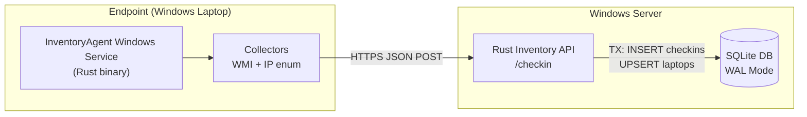

# Inventory System Architecture Diagram

```mermaid
flowchart LR
    subgraph Endpoint["Endpoint (Windows Laptop)"]
      SVC["InventoryAgent Windows Service\n(Rust binary)"]
      COL["Collectors\nWMI + IP enum"]
      SVC --> COL
    end

    subgraph Server["Windows Server"]
      API["Rust Inventory API\n/checkin"]
      DB[(SQLite DB\nWAL Mode)]
    end

    COL -->|HTTPS JSON POST| API
    API -->|TX: INSERT checkins\nUPSERT laptops| DB
```
