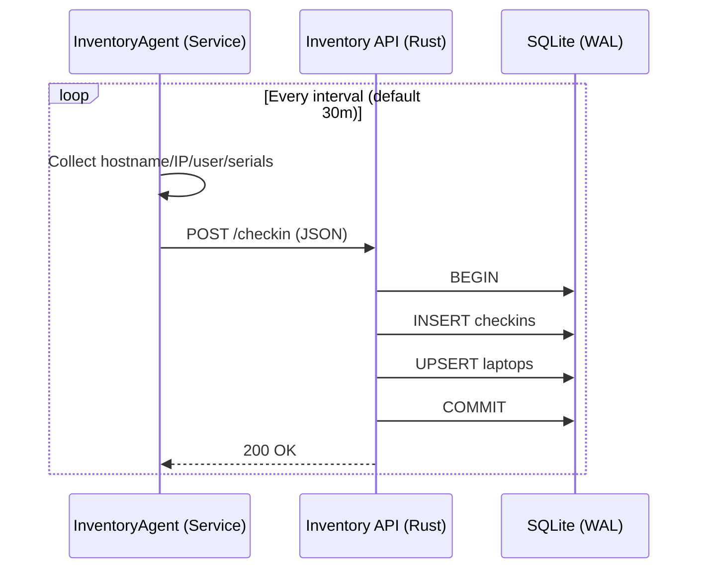

# Inventory System Sequence Diagram

```mermaid
sequenceDiagram
    participant A as InventoryAgent (Service)
    participant API as Inventory API (Rust)
    participant DB as SQLite (WAL)

    loop Every interval (default 30m)
        A->>A: Collect hostname/IP/user/serials
        A->>API: POST /checkin (JSON)
        API->>DB: BEGIN
        API->>DB: INSERT checkins
        API->>DB: UPSERT laptops
        API->>DB: COMMIT
        API-->>A: 200 OK
    end
```
